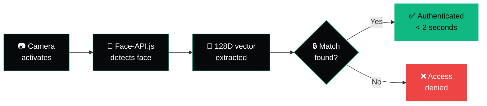
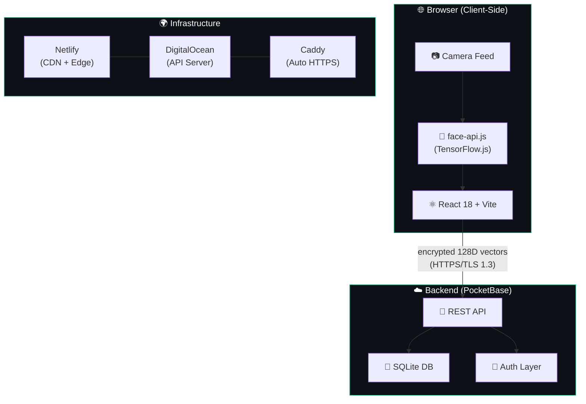

<div align="center">

<!-- ══════════════════════════════════════════════════════════════ -->
<!--                        FACESMASH LOGO                         -->
<!-- ══════════════════════════════════════════════════════════════ -->


<br/><br/>

### **One face. Every device. Every browser. Zero passwords.**

FaceSmash replaces passwords with a glance — on your phone, your laptop, anywhere you sign in.<br/>
Browser-native facial recognition authentication that works cross-platform, cross-device, cross-everything.

<br/>

[](https://facesmash.app)
[](https://docs.facesmash.app)
[](https://www.npmjs.com/package/@facesmash/sdk)
[](https://react.dev)
[](https://www.typescriptlang.org)
[](https://vitejs.dev)
[](https://tailwindcss.com)
[](LICENSE)

<br/>

[**Try the Live Demo →**](https://facesmash.app/register)&nbsp;&nbsp;&nbsp;|&nbsp;&nbsp;&nbsp;[**SDK Docs →**](https://docs.facesmash.app)&nbsp;&nbsp;&nbsp;|&nbsp;&nbsp;&nbsp;[**npm Package →**](https://www.npmjs.com/package/@facesmash/sdk)&nbsp;&nbsp;&nbsp;|&nbsp;&nbsp;&nbsp;[**View Changelog**](#-changelog)

<br/>

</div>

<!-- ══════════════════════════════════════════════════════════════ -->
<!--                     THE PASSWORD PROBLEM                      -->
<!-- ══════════════════════════════════════════════════════════════ -->

## 🔴 The Problem: Passwords Are Broken

The numbers don't lie — password-based authentication is a **security crisis** and a **developer headache**:

| Stat | Source |
|------|--------|
| **80%** of data breaches involve stolen or weak credentials | [Verizon DBIR 2025](https://www.verizon.com/business/resources/reports/dbir/) |
| **$4.88M** average cost of a data breach in 2024 (up 10% YoY) | [IBM Cost of a Data Breach 2024](https://www.ibm.com/reports/data-breach) |
| **193 billion** credential-stuffing attacks per year | [Akamai State of the Internet](https://www.akamai.com/resources/state-of-the-internet) |
| **80%+** of users still reuse passwords across sites | [DeepStrike 2026](https://deepstrike.io/blog/password-statistics-2025) |
| **$65K/year** spent on password resets alone (250-person company) | [Specops Software](https://specopssoft.com/blog/save-money-self-service-password-resets/) |
| **1 billion+** credentials stolen by malware in 2024 | [SpyCloud Annual Report 2025](https://spycloud.com/blog/2025-annual-identity-exposure-report/) |

Meanwhile, **72% of consumers prefer facial biometrics over passwords** ([OLOID 2025](https://www.oloid.com/blog/biometrics-by-the-numbers-a-deep-dive-into-trends-adoption-and-challenges)), and the global biometrics market is projected to hit **$267 billion by 2033** at a 20% CAGR ([Precedence Research](https://www.precedenceresearch.com/biometrics-market)).

**The future is passwordless. FaceSmash is how you build it.**

<br/>

<!-- ══════════════════════════════════════════════════════════════ -->
<!--                      WHAT IS FACESMASH                        -->
<!-- ══════════════════════════════════════════════════════════════ -->

## 🧬 What is FaceSmash?

FaceSmash is an **open-source, browser-native facial recognition authentication system** that lets users sign in to any web app with their face — no passwords, no SMS codes, no hardware tokens.

Unlike Apple Face ID (iOS only), Windows Hello (Windows only), or Samsung Face Recognition (Galaxy only), FaceSmash works **in any browser, on any device, on any OS**. It's the cross-platform biometric auth layer the web has been missing.

```
┌─────────────────────────────────────────────────────────────────┐
│                                                                 │
│   "Face ID is great. But it only unlocks your phone."           │
│                                                                 │
│   FaceSmash lives in your browser. It doesn't care if you're    │
│   on iOS, Android, Windows, Mac, or Linux.                      │
│   Visit a site, glance at your camera — you're in.              │
│                                                                 │
└─────────────────────────────────────────────────────────────────┘
```

<br/>

<!-- ══════════════════════════════════════════════════════════════ -->
<!--                        QUICK SPECS                            -->
<!-- ══════════════════════════════════════════════════════════════ -->

## 📦 JavaScript SDK — `@facesmash/sdk`

Add face login to **any** website with the FaceSmash SDK:

```bash
npm install @facesmash/sdk
```

### React (3 lines)

```tsx
import { FaceSmashProvider, FaceLogin } from '@facesmash/sdk/react';

<FaceSmashProvider config={{ apiUrl: 'https://api.facesmash.app' }}>
  <FaceLogin onResult={(r) => r.success && console.log(`Welcome, ${r.user.name}!`)} />
</FaceSmashProvider>
```

### Vanilla JS (4 lines)

```javascript
import { createFaceSmash } from '@facesmash/sdk';

const client = createFaceSmash({ apiUrl: 'https://api.facesmash.app' });
await client.init();
const result = await client.login(images); // base64 data URLs from webcam
```

**Two entry points:**

| Entry Point | Use Case |
|---|---|
| `@facesmash/sdk` | Core client + utilities — works with any framework or vanilla JS |
| `@facesmash/sdk/react` | `<FaceLogin>`, `<FaceRegister>`, `<FaceSmashProvider>`, 4 hooks |

📖 **[Full SDK Documentation →](https://docs.facesmash.app)**

<br/>

## ⚡ At a Glance

<div align="center">

| Metric | Value |
|--------|-------|
| 🎯 **Recognition Accuracy** | 99.97% |
| ⏱ **Authentication Time** | < 2 seconds |
| 🧮 **Face Vector Dimensions** | 128D |
| 🔑 **Passwords to Remember** | 0 |
| 📱 **Devices Supported** | ∞ (any browser) |
| 🧠 **ML Processing** | 100% client-side |

</div>

<br/>

<!-- ══════════════════════════════════════════════════════════════ -->
<!--                     HOW IT WORKS                              -->
<!-- ══════════════════════════════════════════════════════════════ -->

## 🔍 How It Works



**Three steps. Three seconds. That's it.**

| Step | What Happens |
|------|-------------|
| **01 — Visit any site** | Navigate to a site using FaceSmash. Click "Sign in" — works in Chrome, Safari, Firefox, Edge, on any OS. |
| **02 — Glance at camera** | Your browser camera activates. Our AI maps 128 facial vectors in real-time. No photos stored — just encrypted math. |
| **03 — You're in** | Match confirmed in under 2 seconds. Works the same on your phone at a coffee shop or your desktop at home. |

<br/>

<!-- ══════════════════════════════════════════════════════════════ -->
<!--                   ARCHITECTURE OVERVIEW                       -->
<!-- ══════════════════════════════════════════════════════════════ -->

## 🏗 Architecture



**Key design decisions:**
- **Client-side ML** — Raw camera frames *never* leave the browser. Face detection and descriptor extraction happen on-device using TensorFlow.js. Only computed 128D vectors are transmitted.
- **PocketBase backend** — Lightweight, self-contained Go binary with built-in SQLite. No Docker, no Kubernetes, no DevOps drama.
- **Caddy reverse proxy** — Automatic HTTPS via Let's Encrypt. Zero-config TLS termination.
- **Edge-deployed frontend** — Netlify CDN for global sub-50ms TTFB.

<br/>

<!-- ══════════════════════════════════════════════════════════════ -->
<!--                    COMPETITOR COMPARISON                      -->
<!-- ══════════════════════════════════════════════════════════════ -->

## 🥊 How FaceSmash Compares

| Feature | Apple Face ID | Windows Hello | Samsung Face | Passwords | **FaceSmash** |
|---------|:------------:|:-------------:|:------------:|:---------:|:------------:|
| Cross-platform | ❌ iOS/macOS | ❌ Windows | ❌ Samsung | ✅ | **✅** |
| Cross-device | ❌ Single device | ❌ Single device | ❌ Single device | ✅ | **✅** |
| Website auth | ❌ Device unlock | ❌ Device unlock | ❌ Device unlock | ✅ | **✅** |
| No special hardware | ❌ TrueDepth | ❌ IR camera | ✅ | ✅ | **✅** |
| Phishing-resistant | ✅ | ✅ | ⚠️ 2D only | ❌ | **✅** |
| Nothing to remember | ✅ | ✅ | ✅ | ❌ | **✅** |
| Works in browser | ❌ | ❌ | ❌ | ✅ | **✅** |
| Open source | ❌ | ❌ | ❌ | N/A | **✅** |

<br/>

<!-- ══════════════════════════════════════════════════════════════ -->
<!--                        FEATURES                               -->
<!-- ══════════════════════════════════════════════════════════════ -->

## ✨ Features

### 🔒 Security
- **128-dimensional face vectors** — Your face becomes an encrypted mathematical signature, not a photo
- **Client-side processing** — All ML inference runs in-browser via TensorFlow.js; raw frames never touch a server
- **AES-256 encryption** at rest, **TLS 1.3** in transit
- **No third-party sharing** — Biometric descriptors are never sold, licensed, or shared

### ⚡ Performance
- **< 2 second** end-to-end authentication
- **Real-time face detection** with continuous quality scoring
- **Optimized model loading** — tiny face detector + landmark + recognition models (~6MB total)

### 🌍 Universal Compatibility
- Works in **Chrome, Safari, Firefox, Edge** — any browser with WebRTC
- Runs on **iOS, Android, Windows, macOS, Linux**
- No native apps to install, no browser extensions, no plugins

### 🎨 Developer Experience
- **React 18** with TypeScript for type-safe development
- **Vite** for instant HMR and lightning-fast builds
- **shadcn/ui + Tailwind CSS** — beautiful, accessible components out of the box
- **Framer Motion** animations — smooth, physics-based UI transitions
- **PocketBase** backend — single binary, zero-config, batteries included

### 📋 Compliance Ready
- **BIPA** (Illinois Biometric Privacy Act) compliant — written disclosure, consent, retention schedule
- **GDPR** ready — explicit consent, data subject rights, right to erasure
- **CCPA/CPRA** compatible — right to know, delete, and opt-out
- Built-in **Privacy Policy** and **Terms of Service** pages

<br/>

<!-- ══════════════════════════════════════════════════════════════ -->
<!--                      GETTING STARTED                          -->
<!-- ══════════════════════════════════════════════════════════════ -->

## 🚀 Getting Started

### Prerequisites

- **Node.js** 18+ ([install with nvm](https://github.com/nvm-sh/nvm#installing-and-updating))
- **npm** or **bun** (bun lockfile included)
- A device with a **camera** (for face registration/login)

### Quick Start

```bash
# Clone the repository
git clone https://github.com/ever-just/facesmash.app.git

# Navigate to the project
cd facesmash.app

# Install dependencies
npm install

# Start the dev server
npm run dev
```

The app will be running at `http://localhost:5173`.

### Face-API.js Models

FaceSmash uses [face-api.js](https://github.com/justadudewhohacks/face-api.js) for facial recognition. Models are loaded from CDN by default, but for local development you can download them:

```bash
# Download models to public/models/
# Required: tiny_face_detector, face_landmark_68, face_recognition, face_expression
# Source: https://github.com/justadudewhohacks/face-api.js/tree/master/weights
```

Or use the CDN (default):
```
https://cdn.jsdelivr.net/npm/@vladmandic/face-api/model
```

### Environment Setup

The app connects to a PocketBase backend. For local development:

```bash
# Download PocketBase (https://pocketbase.io/docs/)
# Run it on port 8096
./pocketbase serve --http=127.0.0.1:8096
```

Production API: `https://api.facesmash.app`

<br/>

<!-- ══════════════════════════════════════════════════════════════ -->
<!--                       TECH STACK                              -->
<!-- ══════════════════════════════════════════════════════════════ -->

## 🧱 Tech Stack

| Layer | Technology | Why |
|-------|-----------|-----|
| **Framework** | React 18 + TypeScript | Type-safe, component-driven UI with mature ecosystem |
| **Bundler** | Vite 5.4 | Sub-second HMR, native ESM, blazing fast builds |
| **Styling** | Tailwind CSS 3.4 + shadcn/ui | Utility-first CSS with accessible, copy-paste components |
| **Animation** | Framer Motion 12 | Physics-based animations, layout transitions, gestures |
| **Face Recognition** | face-api.js (TensorFlow.js) | Browser-native ML — 128D face descriptors, no server needed |
| **Backend** | PocketBase | Single Go binary: REST API + SQLite + auth + file storage |
| **Hosting** | Netlify (frontend) + DigitalOcean (API) | Edge CDN + dedicated droplet with Caddy auto-HTTPS |
| **State** | React Query (TanStack) | Cache-first data fetching with background revalidation |
| **Routing** | React Router 6 | Declarative routing with lazy loading support |
| **Forms** | React Hook Form + Zod | Performant forms with schema-based validation |

<br/>

<!-- ══════════════════════════════════════════════════════════════ -->
<!--                      PROJECT STRUCTURE                        -->
<!-- ══════════════════════════════════════════════════════════════ -->

## 📂 Project Structure

```
facesmash.app/
├── public/
│   └── models/              # face-api.js model weights (optional, uses CDN by default)
├── src/
│   ├── components/
│   │   ├── dashboard/       # Dashboard widgets (profile, security, activity)
│   │   ├── login/           # Login flow components (face scan, footer, errors)
│   │   ├── ui/              # shadcn/ui primitives (button, input, toast, etc.)
│   │   ├── AppNav.tsx       # Global navigation bar
│   │   ├── AutoFaceDetection.tsx
│   │   ├── ContinuousQualityCapture.tsx  # Real-time face quality scoring
│   │   └── ...
│   ├── contexts/
│   │   ├── AuthContext.tsx   # Authentication state management
│   │   └── FaceAPIContext.tsx # Face-API model loading & state
│   ├── hooks/
│   │   ├── useCurrentUser.ts
│   │   ├── useLoginLogic.ts
│   │   └── ...
│   ├── integrations/
│   │   └── pocketbase/      # PocketBase client & service layer
│   ├── pages/
│   │   ├── Index.tsx         # Landing page
│   │   ├── Register.tsx      # Face registration flow
│   │   ├── Login.tsx         # Face login flow
│   │   ├── Dashboard.tsx     # User dashboard
│   │   ├── Privacy.tsx       # Privacy Policy (BIPA/GDPR compliant)
│   │   ├── Terms.tsx         # Terms of Service
│   │   └── NotFound.tsx      # 404 page
│   ├── services/             # API service layer
│   ├── utils/                # Utility functions (face recognition, storage)
│   ├── App.tsx               # Root component + routing
│   └── main.tsx              # Entry point
├── packages/
│   └── sdk/                 # @facesmash/sdk — publishable npm package
│       ├── src/
│       │   ├── core/        # Client, detection, matching, types
│       │   └── react/       # Provider, FaceLogin, FaceRegister, hooks
│       ├── package.json
│       └── tsup.config.ts
├── docs/                    # Documentation site (Fumadocs/Next.js)
│   ├── content/docs/        # MDX documentation pages
│   └── src/                 # Fumadocs app
├── package.json
├── vite.config.ts
├── tailwind.config.ts
└── netlify.toml              # Netlify deployment config
```

<br/>

<!-- ══════════════════════════════════════════════════════════════ -->
<!--                    WHY DEVELOPERS LOVE IT                     -->
<!-- ══════════════════════════════════════════════════════════════ -->

## 💚 Why Developers Love FaceSmash

### Ship auth in minutes, not weeks

Traditional auth flows require password hashing, email verification, SMS providers, 2FA integration, password reset flows, and security audits. FaceSmash replaces all of that with **one component**:

```tsx
// That's it. That's the auth.
<FaceScanCard onCapture={handleImagesCapture} />
```

### No vendor lock-in

FaceSmash is open source. The face recognition runs entirely in the browser — no proprietary cloud APIs, no per-auth billing, no rate limits. You own the code, the data, and the infrastructure.

### The numbers make the case

> **$65,000/year** — That's what a 250-person company spends just on password resets ([Specops](https://specopssoft.com/blog/save-money-self-service-password-resets/)). FaceSmash makes that number **$0**.

> **80%** of breaches involve stolen credentials ([Verizon DBIR](https://www.verizon.com/business/resources/reports/dbir/)). Biometric auth eliminates the credential vector entirely.

> **72%** of consumers already prefer facial biometrics over passwords ([OLOID](https://www.oloid.com/blog/biometrics-by-the-numbers-a-deep-dive-into-trends-adoption-and-challenges)). Your users *want* this.

<br/>

<!-- ══════════════════════════════════════════════════════════════ -->
<!--                     PRIVACY & SECURITY                        -->
<!-- ══════════════════════════════════════════════════════════════ -->

## 🛡 Privacy & Security

FaceSmash was designed **privacy-first** from day one:

```
┌─────────────────────────────────────────────────────────────────┐
│                                                                 │
│   📷 Camera → 🧠 Browser ML → 📐 128D Vector → 🔒 Encrypted    │
│                                                                 │
│   Raw frames NEVER leave your device.                           │
│   Only encrypted math goes to the server.                       │
│   We can't reconstruct your face. Nobody can.                   │
│                                                                 │
└─────────────────────────────────────────────────────────────────┘
```

- **Biometric data retention**: Deleted within 30 days of account deletion, or 3 years of inactivity (BIPA-compliant)
- **No human access**: No employee has routine access to stored facial descriptors
- **Full user control**: Export, correct, or delete your data at any time from the dashboard
- **Compliance**: BIPA, GDPR, CCPA/CPRA ready with built-in [Privacy Policy](https://facesmash.app/privacy) and [Terms of Service](https://facesmash.app/terms)

<br/>

<!-- ══════════════════════════════════════════════════════════════ -->
<!--                        DEPLOYMENT                             -->
<!-- ══════════════════════════════════════════════════════════════ -->

## 🌐 Deployment

### Frontend (Netlify)

The frontend auto-deploys to Netlify from the `main` branch:

```bash
npm run build          # Build for production
npm run preview        # Preview the build locally
```

Production URL: **[https://facesmash.app](https://facesmash.app)**

### Backend (PocketBase on DigitalOcean)

The PocketBase API runs on a DigitalOcean droplet with Caddy reverse proxy:

- **API URL**: `https://api.facesmash.app`
- **Reverse proxy**: Caddy with automatic Let's Encrypt certificates
- **Database**: SQLite (embedded in PocketBase)

<br/>

<!-- ══════════════════════════════════════════════════════════════ -->
<!--                        SCRIPTS                                -->
<!-- ══════════════════════════════════════════════════════════════ -->

## 📜 Available Scripts

| Command | Description |
|---------|------------|
| `npm run dev` | Start dev server with HMR at `localhost:5173` |
| `npm run build` | Production build to `dist/` |
| `npm run build:dev` | Development build (source maps, no minification) |
| `npm run preview` | Preview production build locally |
| `npm run lint` | Run ESLint |

<br/>

<!-- ══════════════════════════════════════════════════════════════ -->
<!--                        CHANGELOG                              -->
<!-- ══════════════════════════════════════════════════════════════ -->

## 📋 Changelog

### v2.0.0 — March 7, 2026
**SDK Release & Documentation**
- 🚀 Published [`@facesmash/sdk`](https://www.npmjs.com/package/@facesmash/sdk) v0.1.0 to npm
- 🚀 React components: `<FaceSmashProvider>`, `<FaceLogin>`, `<FaceRegister>`
- 🚀 React hooks: `useFaceSmash()`, `useFaceLogin()`, `useFaceRegister()`, `useFaceAnalysis()`
- 🚀 Core client: `createFaceSmash()` — framework-agnostic face auth
- 🚀 Low-level API: `loadModels()`, `analyzeFace()`, `extractDescriptor()`, `enhancedMatch()`, `multiTemplateMatch()`
- 📖 Full documentation site at [docs.facesmash.app](https://docs.facesmash.app)
- 🔐 SDK announcement banner + cookie consent on main site
- 🧠 Migrated face-api.js → @vladmandic/face-api ^1.7.15 (SSD MobileNet v1 primary, TinyFaceDetector fallback)
- 🧠 Adaptive threshold matching with lighting compensation and confidence boost
- 🧠 Multi-template learning — accuracy improves with each login

### v1.3.0 — March 7, 2026
**Legal & Compliance**
- ✅ Added **Privacy Policy** page — BIPA, GDPR, and CCPA/CPRA compliant
- ✅ Added **Terms of Service** page — covers biometric consent, prohibited conduct, dispute resolution
- ✅ Updated footer links to route to new legal pages
- ✅ Complete **README rewrite** — developer-focused with data points, architecture diagrams, and changelog

### v1.2.0 — March 1, 2026
**Full Redesign**
- 🎨 Redesigned entire UI/UX — Login, Register, Dashboard, Loading, and 404 pages
- 🎨 Unified emerald/teal design system with editorial typography
- 🎨 New landing page — competitor comparison, cross-platform narrative, animated face mesh hero
- 🎨 Film-grain overlay, ambient lighting, and Framer Motion animations throughout

### v1.1.0 — February 2026
**Face Recognition Overhaul**
- 🧠 Implemented continuous quality capture with real-time scoring
- 🧠 Dynamic face tracking with 128D vector extraction
- 🧠 Optimized face detection — switched to `TinyFaceDetector` for performance
- 🔧 Fixed login page freeze caused by infinite re-render loop
- 🔧 Resolved camera initialization and loading flow issues
- 🔧 Fixed face scan creation and storage pipeline

### v1.0.0 — January 2026
**Initial Release**
- 🚀 Face registration and login flow
- 🚀 PocketBase backend integration
- 🚀 Dashboard with profile, security card, and activity graph
- 🚀 Face scan gallery with storage management
- 🚀 Deployed to Netlify (frontend) and DigitalOcean (API)

<br/>

<!-- ══════════════════════════════════════════════════════════════ -->
<!--                         FOOTER                                -->
<!-- ══════════════════════════════════════════════════════════════ -->

<div align="center">

---

**Built by [EVERJUST COMPANY](https://facesmash.app)** · © 2026

[Live Demo](https://facesmash.app) · [SDK Docs](https://docs.facesmash.app) · [npm Package](https://www.npmjs.com/package/@facesmash/sdk) · [Privacy Policy](https://facesmash.app/privacy) · [Terms of Service](https://facesmash.app/terms)

<br/>

<sub>Stop typing passwords. Start shipping the future.</sub>

</div>
